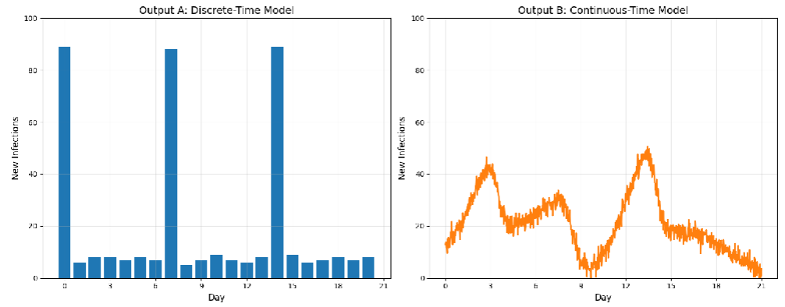

# **Laboratorio 3** **Modelación y Simulación**

**Sección 20**

- Monica Salvatierra - 22249
- Derek Arreaga - 22537
- Paula Barillas - 22764

>Link del repositorio: https://github.com/FabianKel/ModSim-LAB4

## **Partes individuales:**
- [Ejercicio 1](ejercicio1.ipynb)
- [Ejercicio 2](ejercicio2.ipynb)
- [Ejercicio 3](ejercicio3.ipynb)
- [Ejercicio 4](ejercicio4.ipynb)

---
## [**Ejercicio 1**](ejercicio1.ipynb)
**Defina y responda**
### 1. Comparar la simulación de tiempo discreto (síncrona) y de tiempo continuo (asíncrona):

- Describir escenarios donde cada una es preferible.

***Tiempo Discreto (Síncrono):***
Este puede ser utilizado para hacer análisis en salud por ejemplo el ver medidas que se implementan diariamente (como restricciones, vacunaciones). O bien en sistemas con actualizaciones naturalmente periódicas como funcioanan los hospitales que reportan datos diariamente, turnos de personal

***Tiempo Continuo (Asíncrono):***

Esta puede ser utilizada para estudios detallados de transmisión, como el análisis preciso de cómo y cuándo ocurren las infecciones o bien evaluaciones de medidas de control en tiempo real. 

- Analizar las compensaciones computacionales (velocidad vs. precisión).

| Aspecto  | Tiempo Discreto (Síncrono) | Tiempo Continuo (Asíncrono)                |
|----------------------|------------------------------------------|---------------------------------------------|
| **Velocidad**        | Más rápido para simulaciones largas      | Más lento por overhead de eventos        |
| **Precisión Temporal** | Limitada al tamaño del paso           | Alta precisión en el timing de eventos   |
| **Memoria**          | Hace menor uso de memoria                    | Mayor uso por gestión de cola de eventos |
| **Paralelización**   | Es más fácil de paralelizar                    | Es más complejo de paralelizar             |
| **Determinismo**     | reproducible con misma semilla          | Sensible al orden de eventos            |

En general el tiempo discreto es preferible cuando se prioriza la velocidad y la simplicidad, especialmente en sistemas donde los eventos ocurren a intervalos regulares y la precisión temporal no es crítica. Ahora bien, el tiempo continuo es ideal cuando se requiere alta precisión en el momento exacto de los eventos, aunque esto implica mayor complejidad computacional y de memoria.

### 2. Sobre los mecanismos de gestión de eventos:
   
**a. ¿Cómo las colas de eventos gestionan los cambios de estado?**
- En simulaciones de eventos discretos (tiempo continuo), se utiliza una cola de prioridad (generalmente implementada como un heap) para almacenar los eventos futuros ordenados por su timestamp (momento de ocurrencia). En donde el evento con el timestamp más bajo se procesa primero, garantizando la consistencia temporal y que los cambios de estado ocurran en el orden correcto.Cuando se procesa un evento, este puede generar nuevos eventos que se insertan en la cola manteniendo el orden. La inserción y extracción en la cola de prioridad es eficiente (O(log n)), permitiendo escalar a simulaciones con muchos eventos. Si dos o más eventos tienen el mismo timestamp, se aplican reglas de desempate para asegurar reproducibilidad y coherencia.

**b. Gestión de prioridades para eventos concurrentes:**
- Cuando varios eventos ocurren exactamente al mismo tiempo, es fundamental definir una jerarquía de prioridades para evitar ambigüedades en el estado del sistema.

Un ejemplo típico de jerarquía de prioridades en simulaciones epidemiológicas podría ser:

1. Eventos de muerte (máxima prioridad, ya que afectan la existencia del agente)

2. Eventos de recuperación

3. Eventos de infección

4. Eventos de movimiento

5. Eventos de contacto (menor prioridad)

En donde (en este caso) jerarquía asegura que un agente que muere no pueda infectar ni moverse después de su muerte, manteniendo la lógica y consistencia del modelo. Donde la gestión adecuada de prioridades es clave para evitar resultados inconsistentes y garantizar la reproducibilidad de la simulación.

---

## [**Ejercicio 2**](ejercicio2.ipynb)
#### **Defina y responda:**
**1. Considere la taxonomía de rasgos, clasifique y justifique cada uno de los siguientes (discreto, continuo o relacional):**

 **a. Edad**
- A pesar de que se suele medir discretamente, en realidad es una variable **continua**. Esto se debe a que la edad puede tomar un valor numérico en un rango que no se limita a un conjunto discreto de categorías predeterminadas. Es decir, podemos expresar la edad en decimales (ej. 12.5 años), representando una cantidad medible.

**b. Profesión**
- Es una variable **discreta**, puesto que una profesión pertenece a un conjunto finito de categorías. Además, no existe una escala numérica que conecte estas categorías, por lo que se considera cualitativa.

**c. Redes de amistad**
- Esta es una variable **relacional**, porque representa explícitamente una conexión o vínculo entre individuos. Se puede modelar como un grafo, en donde los nodos representan a los agentes y las aristas indican las relaciones.

**d. Estado de vacunación**
- Representa una variable **discreta**, puesto que hay un conjunto limitado de posibles valores para representar el estado de vacunación (vacunado, no vacunado, parcalmente vacunado).

 

**2. Calcule el tamaño total del espacio de parámetros y responda ¿cómo podría afectar esto al tiempo de ejecución de la simulación?**

Para esto, considere un escenario de 10,000 agentes con:

**a. 3 rasgos continuos (p. ej., tasa de movilidad)**
- Para rasgos contínuos, teóricamente su espacio de parámetros tiene la posibilidad de tomar valores infinitos, ya que cada rasgo puede tomar cualquier valor real dentro de su rango definido. Sin embargo, en la práctica, se discretiza cada rasgo en $k_i$ niveles (dividir el rango en pasos uniformes).

Las combinaciones por los 3 rasgos por agente se calcularían como:

$$
k_c * k_c * k_c = k_c^3
$$

En el caso de ser 10,000 agentes, el número total de configuraciones posibles sería de:

$$
(k_c^3)^{10000}
$$

- En tiempos de ejecución, si aumentamos $k_i$ (la resolución), el número de configuraciones a probar,y por tanto el tiempo total de experimentación. Cada corrida además cuesta al menos $$ O(agentes * pasos) $$

**b. 2 rasgos discretos (p. ej., ocupación)**
- Sea $k_{d1}$ el número de categorías del primer rasgo discreto y $k_{d2}$ el del segundo

Las combinaciones por los 2 rasgos por agente se calcularían como:

$$
k_{d1} * k_{d2}
$$

De la misma manera, las asignaciones posibles para toda la población sería de:

$$
(k_{d1}* k_{d2})^{10000}
$$

- Si hablamos del tiempo de ejecución, a diferencia de los rasgos continuos, aquí el espacio de parámetros es finito. Esto significa que, aunque sigue creciendo conforme aumentan las categorías, lo hace de manera mucho más controlada, por lo que su tamaño crece de forma lineal con el número de valores posibles.

Sin embargo, al escalar la simulación a 10,000 agentes, el número de asignaciones posibles todavía se dispara, por lo que resulta inviable explorar absolutamente todas las configuraciones. Por eso, igual que en los rasgos continuos, lo común es muestrear parte del espacio de parámetros y trabajar con réplicas para capturar la variabilidad.

---

## [**Ejercicio 3**](ejercicio3.ipynb)
### **Defina y responda:**

#### 1. Escenario de ciudad
**a. Modelo temporal:** Tiempo continuo (infecciones impulsadas por eventos)
**b. Distribución de rasgos:**
    - 20% de personas mayores (alto riesgo)
    - 30% de trabajadores esenciales (alta movilidad)
**c. Respuestas:**

1. **¿Cómo podría la interacción del modelo temporal y la distribución de rasgos amplificar los brotes en residencias de ancianos?**

    - El modelo temporal continuo lo que permite es el capturar con mayor precisión los momentos exactos en que ocurren los contactos y las infecciones. El caso de alto riesgo, es si las personas mayores residen en entornos donde los trabajadores esenciales (alta movilidad) interactúan frecuentemente con ellos , los eventos de infección pueden agruparse en intervalos cortos amplificando los brotes en estos lugares. Donde la combinación de alta movilidad y alta vulnerabilidad puede generar picos rápidos y localizados de contagio en residencias de ancianos.

2. **¿Podría el modelado de tiempo discreto ocultar esta dinámica? ¿Por qué?**

    - Consideramos que si, ya que el modelado de tiempo discreto puede ocultar esta dinámica porque agrupa los eventos en intervalos fijos como lo puede ser días. Esto puede hacer que múltiples infecciones que ocurren en un corto periodo se contabilicen como si ocurrieran simultáneamente, perdiendo la resolución temporal fina y dificultando la identificación de cadenas rápidas de transmisión en grupos vulnerables.

#### 2. Curvas de infección simuladas con picos en barrios de bajos ingresos
**a. Identifique dos objetivos de calibración para validar:**
1. **Tiempo de eventos:** Validar que los intervalos entre infecciones simuladas coincidan con los observados en datos reales.
2. **Resultados dependientes de rasgos:** Comparar tasas de casos por nivel de ingresos para asegurar que la simulación reproduce las desigualdades observadas.

**b. ¿Cómo distinguiría entre artefactos del modelo y desigualdades reales?**
- Para distinguir entre artefactos del modelo y desigualdades reales se deben comparar los resultados simulados con datos empíricos y realizar análisis de sensibilidad. En donde si los picos o desigualdades desaparecen o cambian significativamente al modificar supuestos del modelo es probable que sean artefactos. Si persisten bajo diferentes configuraciones y coinciden con patrones observados en la realidad es más probable que reflejen desigualdades reales. En el caso de la gráfica ayuda a identificar patrones anómalos o consistentes con la literatura y los datos reales.

---
## [**Ejercicio 4**](ejercicio4.ipynb)

### **Defina y responda**
#### **1. Considere un escenario con 1M de agentes con:**
**a. Versión homogénea:** 3 rasgos (idénticos para todos los agentes)

**b. Versión heterogénea**: 5 rasgos únicos por agente

**c. Responda:**

Calcule y compare los requisitos de memoria para ambas versiones.
- Los cálculos se realizaron asumiendo que cada rasgo se almacena como un valor de punto flotante de 64 bits (8 bytes).
    - **Versión homogénea:** Como los 3 rasgos son idénticos para todos los agentes, solo se almacenarán una vez. Es por eso que la memoria total será de $3 \text{ rasgos } * 8 \text{ bytes } = 24$. **24 bytes** es extremadamente eficiente, ya que no hay duplicación y los agentes simplemente se referencian los valores compartidos.

    - **Versión heterogénea:** En este caso, los rasgos son únicos por cada agente. Por lo que la memoria total para los **1M** de agentes sería de $10^6 \text{ agentes } * 5 \text{ rasgos } * 8 \text{ bytes } = 40,000,000 \text{ bytes (40 MB)}$

    - **Comparación:** la versión heterogénea requiere demasiada memoria comparada a la homogénea (**40 MB** vs **24 bytes**). Esto se debe a la duplicación por agente en la heterogénea, lo que puede llevar a problemas al momento de escadas en simulaciones grandes.

Identifique qué rasgos de los agentes podrían simplificarse de forma segura para mejorar el rendimiento sin perder dinámicas críticas.
- Para mejorar el rendimiento de los agentes se podría ser discretizar las variables **contínuas** como la `Edad`, `Movilidad` o `Inmunidad`.

 

**4. Dadas las curvas resultante de dos simulaciones que se muestran abajo, considere que cada una de estas:**

**a. Resultado A:** Muestra eventos de superpropagación claros (modelado discreto de tiempo)
- Los picos se dan precisamente en intervalos semanales.
- No hay infecciones reportadas entre los días **6-7** o **13-14**
- Distribución de rasgos del agente:
    1. Edad – Discreta - [0-17, 18-65, 65+]
    2. Movilidad – Continua - 0.1–5.0 (Contactos diarios)

**b. Resultado B:** Muestra patrones de transmisión uniformes (Modelo de tiempo continuo)
-  Los picos se producen a intervalos irregulares (días 3.2, 8.7 y 14.1).
- Transmisión de bajo nivel entre brotes importantes.
- Distribución de rasgos del agente
    1. Edad – Continua – **0-100 años**
    2. Inmunidad – Continua – **0.0-1.0 score de protección**

**c. Reponda:**
- Para el resultado A:
    1. ¿Por qué los intervalos perfectos de 7 días sugieren un modelado de tiempo discreto?
        - En un modelo discreto, las actualizaciones de estado ocurren en pasos fijos, sincronizando eventos artificialmente. Esto produce picos exactos en múltiplos de 7, ya que las transmisiones se van a ir acumulando y resolviendo solo al final de cada paso, en lugar de fluir continuamente.
    2. ¿Cómo podría esto distorsionar la dinámica de transmisión en el mundo real?
        - En el mundo real las transmisiones ocurren en tiempo contínuo, que además son influenciadas por eventos aleatorios y asincrónicos. El tiempo discreto podría exagerar picos sincronizados, como hacer que todos los contagios esperan a ser curados hasta el fin de semana, subestimar propagación gradual y ocultar variabilidad entre la semana, todo esto llevaría a tener predicciones inexactas sin reflejar brotes reales constantes.
- Para el resultado B:
    1. ¿Qué evidencia indica un procesamiento continuo?
    - Se puede decir que los eventos ocurrieron en tiempo real gracias a los picos irregulares como en días decimales (3.2, 8.7, 14.1), además de la transmisión de bajo nivel entre ellos. Estos cambios permiten actualizaciones asincrónicas y acumulaciones no sincronizadas.
    2. ¿Por qué las infecciones entre picos son visibles aquí, pero no en el Resultado A?
    - En continuo, las infecciones pueden ocurrir en cualquier momento, capturando transmisiones menores y residuales entre brotes. Mientras que en el Resultado A que es discreto, las actualizaciones batch procesan todo al final de intervalos fijos, ocultando o agrupando eventos intermedios, resultando en periodos de cero infecciones que no aparecen en B.
- Análisis adicional:
    - El resultado A muestra picos de tamaño idéntico a pesar de las diferentes puntuaciones de movilidad. ¿Es esto realista? ¿Por qué?
        - No es realista. La movilidad (continua, 0.1-5.0 contactos diarios) debería introducir variabilidad: agentes con alta movilidad propagarían más, causando picos irregulares o crecientes. Los picos idénticos sugieren que el modelo discreto promedia o ignora esta heterogeneidad (e.g., contactos se resuelven uniformemente por paso), distorsionando la realidad donde superpropagadores con alta movilidad amplifican brotes de manera desigual, como en eventos COVID-19.
    - El resultado B muestra algunos eventos superpropagadores (el pico del día 8.7 es tres veces mayor que otros). ¿Qué rasgo(s) podría(n) explicar esto?
        - Principalmente el rasgo de inmunidad (continua, 0.0-1.0 score de protección), ya que bajos scores en clusters de agentes podrían permitir transmisión explosiva en un momento específico, amplificando un brote. La edad (continua, 0-100) podría contribuir si coincide con vulnerabilidad en grupos (e.g., adultos jóvenes con alta interacción), pero la inmunidad es más directa para explicar multiplicadores extremos, ya que modula la susceptibilidad individualmente.
- Proponga:
    1. Una prueba de sensibilidad temporal para el resultado A (p. ej., repetir la ejecución con intervalos de 12 horas frente a 24 horas).
        1. Repetir la simulación con intervalos de tiempo más finos, como 12 horas vs. 24 horas.
        2. Comparar los picos: un paso de 12 horas debería suavizar los intervalos perfectos de 7 días, revelando transmisiones intermedias y variabilidad por movilidad, para evaluar si el discreto artificialmente sincroniza eventos.
    2. Una prueba de aleatorización de rasgos para el resultado B para aislar los efectos de inmunidad frente a la edad
        1. Ejecutar múltiples corridas donde se aleatorice la inmunidad vs. aleatorizar edad.
        2. Medir el impacto en picos : si aleatorizar inmunidad reduce superpropagación más que edad, confirma su rol dominante
